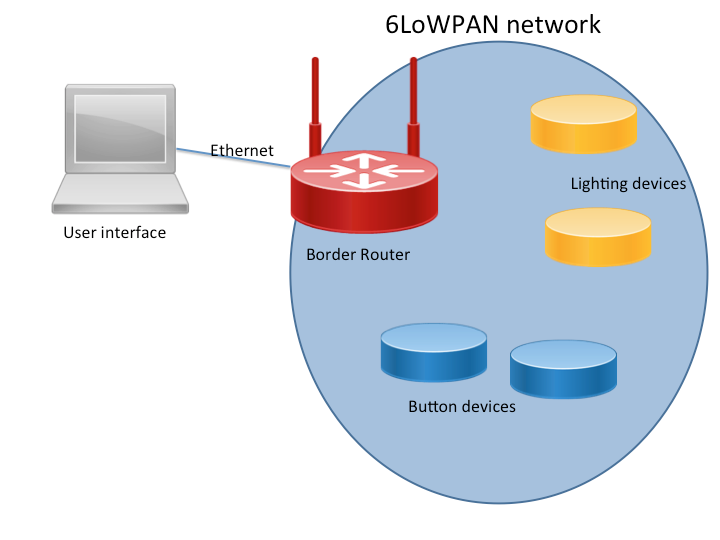
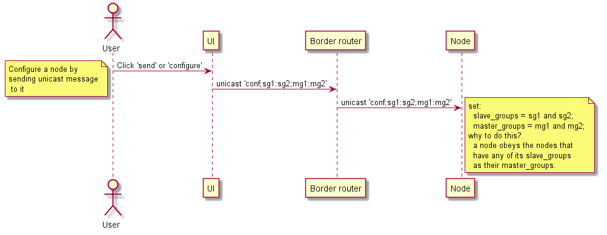
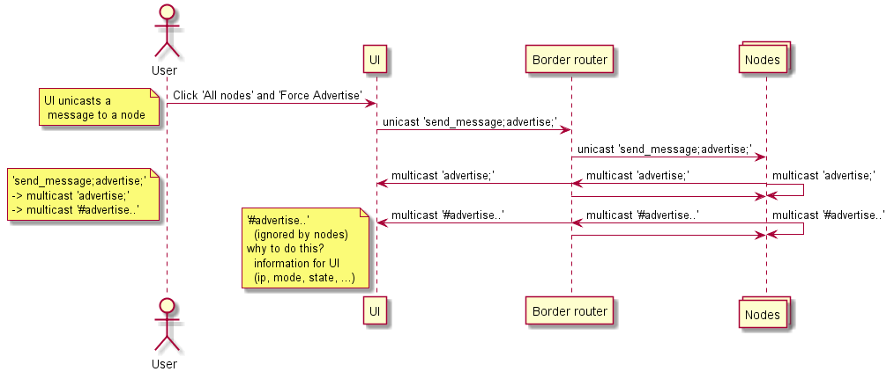

# Master-slave example application for mbed OS
This is a smart home IoT project. The current state of the project is _working prototype_. The aim of the project is to develop software for configuring [mesh nodes](ARMmbed/mbed-os-example-mesh-minimal) in a [mbed](https://www.mbed.com/en/) network in such a way that they _obey commands (such as turning a led on / off) from_ only certain nodes.

## Getting started

### Architecture

* (Zero or more instances) [Python GUI](PythonServer).
* (Zero or more instances) [Modified mbed-os-example-mesh-minimal](mesh) ([see Original](https://github.com/ARMmbed/mbed-os-example-mesh-minimal)).
* (One instance) [Modified nanostack-border-router](router) ([see Original](https://github.com/ARMmbed/nanostack-border-router)).

**The software is currently configured for the architecture below:**

### Required

* The [mesh](mesh) and router [router](router) nodes are configured for the following hardware:
  * [An FRDM-K64F development board (client end-point).](https://os.mbed.com/platforms/FRDM-K64F/)
  * [An mbed 6LoWPAN shield (with a radio module).](https://l-tek.si/web-shop/l-tek-6lowpan-arduino-shield-900mhz/)
* The [GUI](PythonServer) works on Linux / Debian operating systems.

### Setup

1. First [get a router running](router).
2. Then [get one or more mesh nodes running](mesh).
3. And last but not least, [let the GUI join the party](PythonServer).

### Examples

**Configure a node**

**Force all nodes to advertise (identify themselves)**

### REQUIREMENTS (Course work requirements)

#### _Requirements for User Interface_

* [x] Joins a multicast group address which is defined for the demo.
* [x] Listens for incoming advertisements from nodes.
* [x] Displays a list of found nodes for user, separate by function (button/switch, light)
  * The implementation enables copying of all the nodes as a string (in which nodes are separated by newline characters) into the clipboard.
  * The copied data can then be pasted and viewed / sorted as the user wishes.
  *   (It is also possible to paste the data back to the GUI)
* [x] Allows user to create connection between a button and a light.
  * Implemented, though simpler interface would be appreciated.
* [x] When creating connection, send a unicast message for node telling which button to listen to.

#### _Requirements for Node applications_

* Node may refer to a button or a lighting node which both contain very similar software.
  * Only advertise message is different at the moment

* [x] Application connects to 6LoWPAN-ND based network
* [x] Application receives IPv6 address from network
* [x] Once connected node joins to a specified multicast group
* [x] Node listens for UDP messages on port 1030

#### _Requirements for Light node_

* This is a node which contains a light bulb or LED connected to it.

* [x] When receiving a controlling message from the user interface, records the address which this node should listen to for incoming switch commands.
   * The implementation records group_id(s) instead of address(es)
* [x] When receiving a multicasted message from a button node, compares the source address to one received from UI. If matches, switches the light.
   * The implementation compares groups_id(s) instead of address(es).

